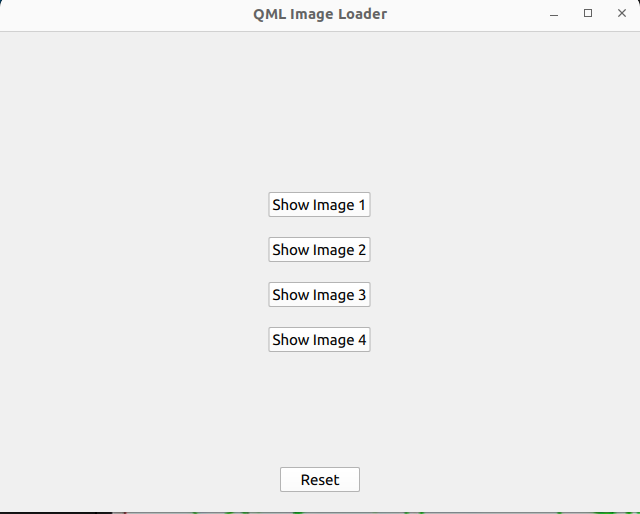
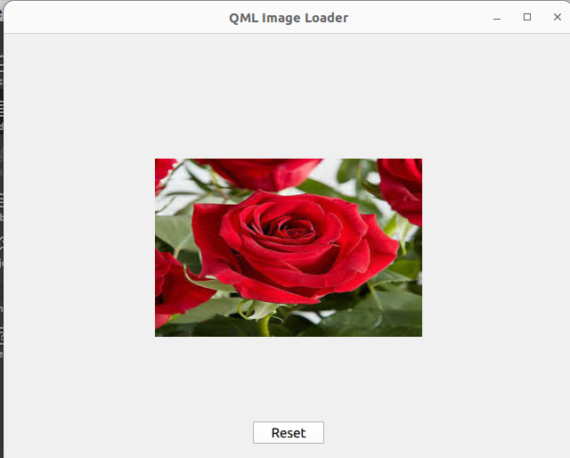
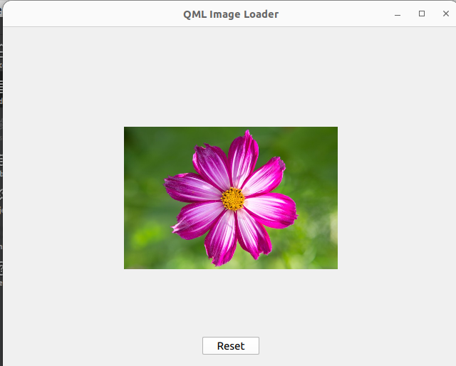
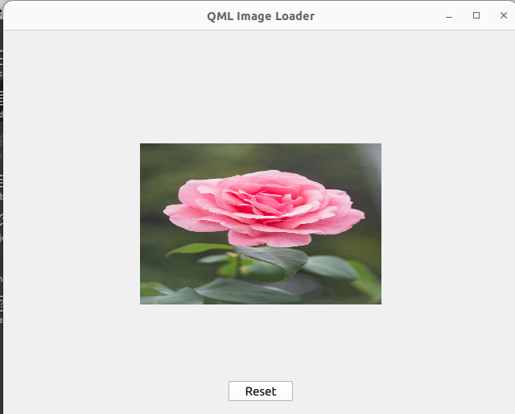
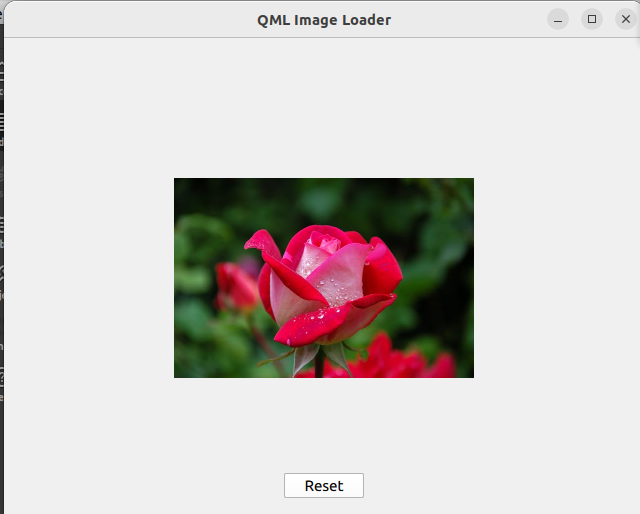

# QT
## You can download the provided Vedio for the output 

```
import QtQuick
import QtQuick.Controls
Window {
    width: 640
    height: 480
    visible: true
    title: qsTr("QML Image Loader")

    Rectangle {
            width: parent.width
            height: parent.height
            color: "#f0f0f0"

            // Buttons Container
            Column {
                id: buttonContainer
                anchors.centerIn: parent
                spacing: 20

                Button {
                    text: "Show Image 1"
                    onClicked: {
                        img1.visible = true;
                        img1TxtId.visible=true;
                        buttonContainer.visible = false;
                    }
                }

                Button {
                    text: "Show Image 2"
                    onClicked: {
                        img2.visible = true;
                        img2TxtId.visible=true;
                        buttonContainer.visible = false;
                    }
                }

                Button {
                    text: "Show Image 3"
                    onClicked: {

                        img3.visible = true;
                        img3TxtId.visible=true;
                        buttonContainer.visible = false;
                    }
                }

                Button {
                    text: "Show Image 4"
                    onClicked: {
                        img4.visible = true;
                        img4TxtId.visible=true;
                        buttonContainer.visible = false;
                    }
                }
            }

            // Image 1: Using `Image` directly
            Image {
                id: img1
                source: "file:image_1.jpeg"
                width: 300
                height: 200
                anchors.centerIn: parent
                visible: false
               Text{
                  id:img1TxtId
                  text: qsTr("Loaded From Working Directory")
                  y:img1.y+img1.height+20
                  visible:false
               }
            }

            // Image 2: Using `Full path`

            Image {
                id: img2
                source: "file:/home/fatma/Task2/images/image_2.jpg"
                width: 300
                height: 200
                anchors.centerIn: parent
                visible: false
               Text{
                  id:img2TxtId
                  text: qsTr("Loaded By its Full path")
                  y:img2.y+img2.height+20
                  visible:false
               }
            }

            // Image 3: Using `resources file`

            Image {
                id: img3
                source: "qrc:images/image_3.jpg"
                width: 300
                height: 200
                anchors.centerIn: parent
                visible: false
               Text{
                  id:img3TxtId
                  text: qsTr("Loaded From resources file ")
                  y:img3.y+img3.height+20
                  visible:false
               }
            }
              // Image 3: Using `internet`
            Image {
                id: img4
                source: "https://images.pexels.com/photos/56866/garden-rose-red-pink-56866.jpeg?auto=compress&cs=tinysrgb&w=600"
                width: 300
                height: 200
                anchors.centerIn: parent
                visible: false
               Text{
                  id:img4TxtId
                  text: qsTr("Loaded From internet")
                  y:img4.y+img4.height+20
                  visible:false
               }
            }

            // Reset Button
            Button {
                text: "Reset"
                anchors.bottom: parent.bottom
                anchors.horizontalCenter: parent.horizontalCenter
                anchors.margins: 20
                onClicked: {
                    buttonContainer.visible = true;
                    img1.visible = false;
                    img2.visible = false;
                    img3.visible = false;
                    img4.visible = false;
                }
            }
        }
}
```






